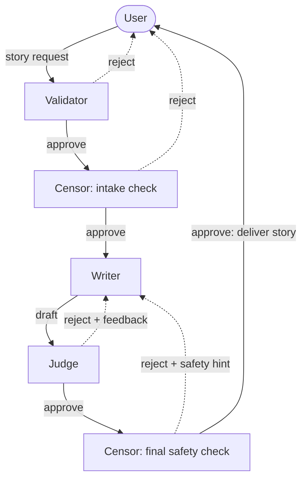

# Hypnos — Multi-Agent Bedtime Story Generator

An interactive CLI that generates bedtime stories for children aged 5–10 using a multi-agent pipeline: validator, censor, writer, and judge. Built on OpenAI's `gpt-3.5-turbo`.

Named for [Hypnos](https://en.wikipedia.org/wiki/Hypnos), the Greek god of sleep.

## Setup

```bash
git clone <repo-url>
cd hypnos

# Set up your environment file with your OpenAI API key
cp .env.example .env
# then edit .env and paste in your OPENAI_API_KEY

# Install dependencies
pip install -r requirements.txt

# Run
python main.py
```

## How it works



Solid arrows = pass-through; dotted arrows = rejection paths.

The four agents:

1. **Validator** — confirms the user is engaging with the story chatbot (rejects off-topic, gibberish, or prompt-injection attempts). Permissive on themes — content safety is the censor's job.
2. **Censor (intake)** — gates user input for child-appropriateness. Shares an intake log with the validator so it can interpret follow-ups after a rejection (e.g. "with a parachute, on his birthday" after "thrown out of a plane" reframes the request as safe).
3. **Writer** — drafts the story. For revisions, it sees the previous story plus the new request.
4. **Judge** — evaluates the draft against a rubric (structure, vocabulary, sentence length, calming ending, length). Loops with the writer up to 3 times for revisions.

The censor also runs a **final safety check** on the approved draft. If it flags the story, the writer restarts with a safety hint (up to 2 attempts).

## Commands

Inside the REPL:

- Type any change you'd like to make to the current story.
- `/new` — start a fresh story (prompts for input).
- `/new <prompt>` — start a fresh story using `<prompt>` directly.
- `Ctrl+C` — exit.

## Project structure

```
main.py        — REPL + orchestrator (process_user_request)
pipeline.py    — pipeline helpers (validate_and_censor_input, combine_user_turns, write_story, writer_judge_loop)
agent.py       — Agent class wrapping the OpenAI API
agents.py      — Agent instances and system prompts
ASSIGNMENT.md  — original assignment brief
logs/          — per-session JSONL logs of every agent call (gitignored)
```

## Notes

- **Model** is locked to `gpt-3.5-turbo` per the original assignment.
- Every agent call is logged (full messages, response, token usage, latency) to `logs/<timestamp>.jsonl` for debugging.
- API key lives in `.env` — never commit it. (`.env` is gitignored.)
